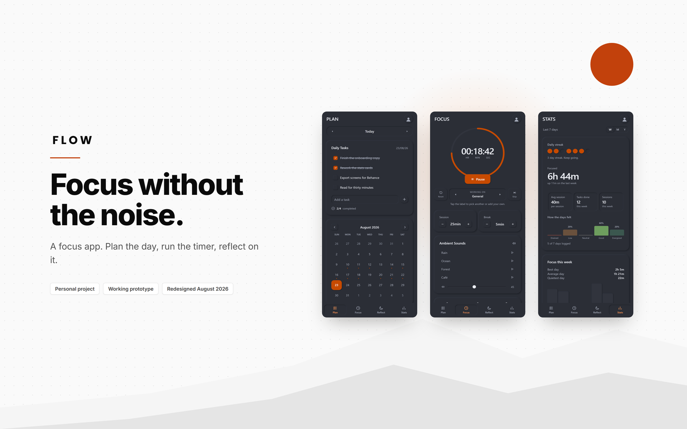

# Flow

A focus app that runs in the browser. Plan the day, run the timer, reflect on how
it went.

### [Open the live demo](https://arihantslittlecave.github.io/flow-focus-app/)

That link is the project. It opens on a phone or a laptop, needs nothing
installed, and works straight away.

No sign up, no account, no server. Everything stays in your own browser, in
`localStorage`, and exports as readable JSON whenever you want it.

## About

A personal design project, and a portfolio piece rather than a product.

Two iterations. The first went up in January 2026 as a set of designs. This one,
in August 2026, is the same idea built as working software. The 13 slide case
study comparing them is on Behance.

It is plain HTML, CSS and JavaScript. No framework, no dependencies, and once the
page has loaded it makes no network requests at all. The whole app is one file.

Every screen and control is covered by an automated suite of 215 checks driven by
real mouse events, plus a second suite that drives the app with real touch events
at four phone and tablet sizes, in both themes.

A native version may follow if the idea earns it.

## Licence

Copyright Arihant. All rights reserved.

The source is here to be looked at, not taken. No permission is given to copy,
reuse, modify or redistribute any part of it, in whole or in part, including as
training data. If you want to use something, ask me first.
